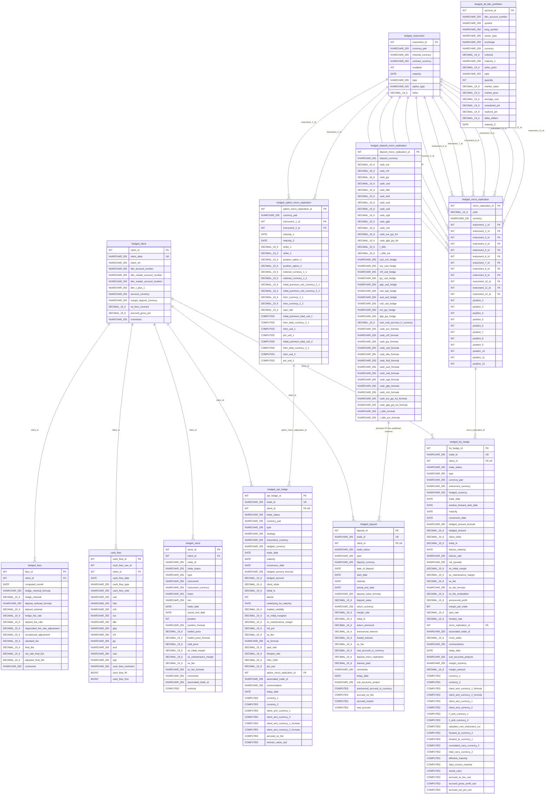

# HedgeIt Database ER Diagram

```mermaid
erDiagram
    hedgeit_client ||--o{ hedgeit_fut_hedge : "client_id"
    hedgeit_client ||--o{ hedgeit_opt_hedge : "client_id"
    hedgeit_client ||--o{ hedgeit_deposit : "client_id"
    hedgeit_client ||--o{ hedgeit_stock : "client_id"
    hedgeit_client ||--o{ cash_flow : "client_id"
    hedgeit_client ||--o{ hedgeit_fees : "client_id"

    hedgeit_instrument ||--o{ hedgeit_micro_replication : "instrument_1_id"
    hedgeit_instrument ||--o{ hedgeit_micro_replication : "instrument_2_id"
    hedgeit_instrument ||--o{ hedgeit_micro_replication : "instrument_3_id"
    hedgeit_instrument ||--o{ hedgeit_micro_replication : "instrument_4_id"
    hedgeit_instrument ||--o{ hedgeit_micro_replication : "instrument_5_id"
    hedgeit_instrument ||--o{ hedgeit_micro_replication : "instrument_6_id"
    hedgeit_instrument ||--o{ hedgeit_micro_replication : "instrument_7_id"
    hedgeit_instrument ||--o{ hedgeit_micro_replication : "instrument_8_id"
    hedgeit_instrument ||--o{ hedgeit_micro_replication : "instrument_9_id"
    hedgeit_instrument ||--o{ hedgeit_micro_replication : "instrument_10_id"
    hedgeit_instrument ||--o{ hedgeit_micro_replication : "instrument_11_id"
    hedgeit_instrument ||--o{ hedgeit_micro_replication : "instrument_12_id"

    hedgeit_micro_replication ||--o{ hedgeit_fut_hedge : "micro_replication_id"

    hedgeit_instrument ||--o{ hedgeit_option_micro_replication : "instrument_1_id"
    hedgeit_instrument ||--o{ hedgeit_option_micro_replication : "instrument_2_id"

    hedgeit_option_micro_replication ||--o{ hedgeit_opt_hedge : "option_micro_replication_id"

    %% The SQL declares FK_hedgeit_deposit_micro_replication on hedgeit_deposit.deposit_micro_replication_id
    %% referencing hedgeit_deposit_micro_replication.option_micro_replication_id, but neither column exists in the table definitions.
    hedgeit_deposit_micro_replication ||--o{ hedgeit_deposit : "declared FK has undefined columns"

    hedgeit_client {
        INT client_id PK
        NVARCHAR_255 client_alias UK
        NVARCHAR_255 client_ref
        NVARCHAR_255 ibkr_account_number
        NVARCHAR_255 ibkr_master_account_number
        NVARCHAR_255 ibkr_master_account_location
        NVARCHAR_255 ibkr_t_plus_1
        NVARCHAR_255 account_currency
        NVARCHAR_255 margin_deposit_currency
        DECIMAL_19_6 se_fees_covered
        DECIMAL_19_6 accrued_gross_pnl
        NVARCHAR_255 comments
    }

    hedgeit_instrument {
        INT instrument_id PK
        NVARCHAR_255 currency_pair
        NVARCHAR_255 notional_currency
        NVARCHAR_255 contract_currency
        INT multiplier
        DATE maturity
        NVARCHAR_255 type
        NVARCHAR_255 option_type
        DECIMAL_19_6 strike
    }

    hedgeit_micro_replication {
        INT micro_replication_id PK
        DECIMAL_19_6 cash
        NVARCHAR_255 currency
        INT instrument_1_id FK
        INT instrument_2_id FK
        INT instrument_3_id FK
        INT instrument_4_id FK
        INT instrument_5_id FK
        INT instrument_6_id FK
        INT instrument_7_id FK
        INT instrument_8_id FK
        INT instrument_9_id FK
        INT instrument_10_id FK
        INT instrument_11_id FK
        INT instrument_12_id FK
        INT position_2
        INT position_3
        INT position_4
        INT position_5
        INT position_6
        INT position_7
        INT position_8
        INT position_9
        INT position_10
        INT position_11
        INT position_12
    }

    hedgeit_fut_hedge {
        INT fut_hedge_id PK
        NVARCHAR_255 trade_id UK
        INT client_id FK, UK
        NVARCHAR_255 trade_status
        NVARCHAR_255 type
        NVARCHAR_255 currency_pair
        NVARCHAR_255 instrument_currency
        NVARCHAR_255 hedged_currency
        DATE trade_date
        DATE window_forward_start_date
        DATE maturity
        DATE conversion_date
        NVARCHAR_255 hedged_amount_formula
        DECIMAL_19_6 hedged_amount
        DECIMAL_19_6 client_strike
        DECIMAL_19_6 initial_fx
        DATE futures_maturity
        NVARCHAR_255 futures_rate
        NVARCHAR_255 roll_spreads
        DECIMAL_19_6 se_initial_margin
        DECIMAL_19_6 se_maintenance_margin
        DECIMAL_19_6 se_fee
        NVARCHAR_255 se_fee_formula
        DECIMAL_19_6 se_fee_embedded
        DECIMAL_19_6 announced_profit
        BIT margin_per_trade
        DECIMAL_19_6 spot_rate
        DECIMAL_19_6 forward_rate
        INT micro_replication_id FK
        NVARCHAR_255 associated_trade_id
        DECIMAL_19_6 cross_strike
        NVARCHAR_255 commentaires
        DATE today_date
        NVARCHAR_255 sub_accounts_projects
        NVARCHAR_255 margin_currency
        DECIMAL_19_6 margin_amount
        COMPUTED currency_1
        COMPUTED currency_2
        COMPUTED client_amt_currency_1_formula
        COMPUTED client_amt_currency_2_formula
        COMPUTED client_amt_currency_1
        COMPUTED client_amt_currency_2
        COMPUTED h_amt_currency_1
        COMPUTED h_amt_currency_2
        COMPUTED valuation_non_instrument_cur
        COMPUTED forward_pl_currency_2
        COMPUTED forward_pl_currency_1
        COMPUTED cumulated_carry_currency_2
        COMPUTED total_carry_currency_2
        COMPUTED effective_maturity
        COMPUTED days_excess_maturity
        COMPUTED actual_carry
        COMPUTED accrued_se_fee_usd
        COMPUTED accrued_gross_profit_usd
        COMPUTED accrued_net_pnl_usd
    }

    hedgeit_option_micro_replication {
        INT option_micro_replication_id PK
        NVARCHAR_255 currency_pair
        INT instrument_1_id FK
        INT instrument_2_id FK
        DATE maturity_1
        DATE maturity_2
        DECIMAL_19_6 strike_1
        DECIMAL_19_6 strike_2
        DECIMAL_19_6 position_option_1
        DECIMAL_19_6 position_option_2
        DECIMAL_19_6 notional_currency_1_1
        DECIMAL_19_6 notional_currency_1_2
        DECIMAL_19_6 initial_premium_unit_currency_2_1
        DECIMAL_19_6 initial_premium_unit_currency_2_2
        DECIMAL_19_6 mtm_currency_2_1
        DECIMAL_19_6 mtm_currency_2_2
        DECIMAL_19_6 spot_rate
        COMPUTED initial_premium_total_usd_1
        COMPUTED mtm_total_currency_2_1
        COMPUTED mtm_usd_1
        COMPUTED pnl_usd_1
        COMPUTED initial_premium_total_usd_2
        COMPUTED mtm_total_currency_2_2
        COMPUTED mtm_usd_2
        COMPUTED pnl_usd_2
    }

    hedgeit_opt_hedge {
        INT opt_hedge_id PK
        NVARCHAR_255 trade_id UK
        INT client_id FK, UK
        NVARCHAR_255 trade_status
        NVARCHAR_255 currency_pair
        NVARCHAR_255 type
        NVARCHAR_255 strategy
        NVARCHAR_255 instrument_currency
        NVARCHAR_255 hedged_currency
        DATE trade_date
        DATE maturity
        DATE conversion_date
        NVARCHAR_255 hedged_amount_formula
        DECIMAL_19_6 hedged_amount
        DECIMAL_19_6 client_strike
        DECIMAL_19_6 initial_fx
        INT barriar
        DATE underlying_fut_maturity
        DECIMAL_19_6 implied_volatility
        DECIMAL_19_6 se_initial_marginal
        DECIMAL_19_6 se_maintenance_margin
        DECIMAL_19_6 roll_pnl
        DECIMAL_19_6 se_fee
        NVARCHAR_255 se_formula
        DECIMAL_19_6 spot_rate
        DECIMAL_19_6 forward_rate
        DECIMAL_19_6 mtm_USD
        DECIMAL_19_6 pnl_usd
        INT option_micro_replication_id FK
        NVARCHAR_255 associated_trade_id
        NVARCHAR_255 commentaires
        DATE today_date
        COMPUTED currency_1
        COMPUTED currency_2
        COMPUTED client_amt_currency_1
        COMPUTED client_amt_currency_2
        COMPUTED client_amt_currency_1_formula
        COMPUTED client_amt_currency_2_formula
        COMPUTED accrued_se_fee
        COMPUTED intrinsic_value_usd
    }

    hedgeit_deposit_micro_replication {
        INT deposit_micro_replication_id PK
        NVARCHAR_255 deposit_currency
        DECIMAL_19_6 cash_eur
        DECIMAL_19_6 cash_chf
        DECIMAL_19_6 cash_jpy
        DECIMAL_19_6 cash_usd
        DECIMAL_19_6 cash_dkk
        DECIMAL_19_6 cash_hkd
        DECIMAL_19_6 cash_aud
        DECIMAL_19_6 cash_cad
        DECIMAL_19_6 cash_sgd
        DECIMAL_19_6 cash_gpb
        DECIMAL_19_6 cash_cnh
        DECIMAL_19_6 cash_eur_jpy_fut
        DECIMAL_19_6 cash_gbp_jpy_fut
        DECIMAL_19_6 t_bills
        DECIMAL_19_6 t_bills_eur
        NVARCHAR_255 usd_cnh_hedge
        NVARCHAR_255 eur_usd_hedge
        NVARCHAR_255 chf_usd_hedge
        NVARCHAR_255 jpy_usd_hedge
        NVARCHAR_255 gbp_usd_hedge
        NVARCHAR_255 usd_sgd_hedge
        NVARCHAR_255 aud_usd_hedge
        NVARCHAR_255 cad_usd_hedge
        NVARCHAR_255 eur_jpy_hedge
        NVARCHAR_255 gbp_jpy_hedge
        DECIMAL_19_6 sum_real_accrued_in_currency
        NVARCHAR_255 cash_eur_formula
        NVARCHAR_255 cash_chf_formula
        NVARCHAR_255 cash_jpy_formula
        NVARCHAR_255 cash_usd_formula
        NVARCHAR_255 cash_dkk_formula
        NVARCHAR_255 cash_hkd_formula
        NVARCHAR_255 cash_aud_formula
        NVARCHAR_255 cash_cad_formula
        NVARCHAR_255 cash_sgd_formula
        NVARCHAR_255 cash_gbp_formula
        NVARCHAR_255 cash_cnh_formula
        NVARCHAR_255 cash_eur_jpy_fut_formula
        NVARCHAR_255 cash_gbp_jpy_fut_formula
        NVARCHAR_255 t_bills_formula
        NVARCHAR_255 t_bills_eur_formula
    }

    hedgeit_deposit {
        INT deposit_id PK
        NVARCHAR_255 trade_id UK
        INT client_id FK, UK
        NVARCHAR_255 trade_status
        NVARCHAR_255 type
        NVARCHAR_255 deposit_currency
        DATE date_of_deposit
        DATE start_date
        DATE maturity
        DATE actual_end_date
        NVARCHAR_255 deposit_value_formula
        DECIMAL_19_6 deposit_value
        NVARCHAR_255 return_currency
        DECIMAL_19_6 margin_rate
        DECIMAL_19_6 initial_fx
        DECIMAL_19_6 return_ammount
        DECIMAL_19_6 announced_interest
        DECIMAL_19_6 locked_interest
        DECIMAL_19_6 se_fee
        DECIMAL_19_6 real_accrued_in_currency
        DECIMAL_19_6 deposit_micro_replication
        DECIMAL_19_6 interest_paid
        NVARCHAR_255 comments
        DATE today_date
        NVARCHAR_255 sub_accounts_project
        COMPUTED announced_accrued_in_currency
        COMPUTED accrued_se_fee
        COMPUTED accrued_locked
        COMPUTED real_accrued
    }

    hedgeit_stock {
        INT stock_id PK
        INT client_id FK
        NVARCHAR_255 trade_id
        NVARCHAR_255 trade_status
        NVARCHAR_255 type
        NVARCHAR_255 instrument
        NVARCHAR_255 instrument_currency
        NVARCHAR_255 ticker
        NVARCHAR_255 isin
        DATE trade_date
        DATE actual_end_date
        INT position
        NVARCHAR_255 position_formula
        DECIMAL_19_6 traded_price
        DECIMAL_19_6 traded_price_formula
        DECIMAL_19_6 sold_price
        DECIMAL_19_6 se_initial_margin
        DECIMAL_19_6 se_maintenance_margin
        DECIMAL_19_6 se_fee
        NVARCHAR_255 se_fee_formula
        NVARCHAR_255 comments
        NVARCHAR_255 associated_trade_id
        COMPUTED notional
    }

    cash_flow {
        INT cash_flow_id PK
        INT cash_flow_row_id
        INT client_id FK
        DATE cash_flow_date
        NVARCHAR_255 cash_flow_type
        NVARCHAR_255 cash_flow_note
        NVARCHAR_255 usd
        NVARCHAR_255 hkd
        NVARCHAR_255 cnh
        NVARCHAR_255 eur
        NVARCHAR_255 dkk
        NVARCHAR_255 gbp
        NVARCHAR_255 chf
        NVARCHAR_255 jpy
        NVARCHAR_255 aud
        NVARCHAR_255 cad
        NVARCHAR_255 sgd
        NVARCHAR_255 cash_flow_comment
        BIGINT cash_flow_fill
        BIGINT cash_flow_font
    }

    hedgeit_all_ibkr_portfolios {
        INT account_id PK
        NVARCHAR_255 ibkr_account_number
        NVARCHAR_255 symbol
        NVARCHAR_255 long_symbol
        NVARCHAR_255 sector_type
        NVARCHAR_255 exchange
        NVARCHAR_255 currency
        DECIMAL_19_6 notional
        NVARCHAR_255 maturity_1
        DECIMAL_19_6 strike_price
        NVARCHAR_255 right
        INT quantity
        DECIMAL_19_6 market_value
        DECIMAL_19_6 market_price
        DECIMAL_19_6 average_cost
        DECIMAL_19_6 unrealized_pnl
        DECIMAL_19_6 realized_pnl
        DECIMAL_19_6 delta_dollars
        DATE maturity_2
    }

    hedgeit_fees {
        INT fees_id PK
        INT client_id FK
        DATE computed_month
        NVARCHAR_255 hedge_notional_formula
        DECIMAL_19_6 hedge_notional
        NVARCHAR_255 deposit_notional_formula
        DECIMAL_19_6 deposit_notional
        DECIMAL_19_6 hedge_fee_rate
        DECIMAL_19_6 deposit_fee_rate
        DECIMAL_19_6 negociated_fee_rate_adjustment
        DECIMAL_19_6 exceptional_adjustment
        DECIMAL_19_6 standard_fee
        DECIMAL_19_6 final_fee
        DECIMAL_19_6 net_rate_final_fee
        DECIMAL_19_6 adjusted_final_fee
        NVARCHAR_255 comments
    }
```
